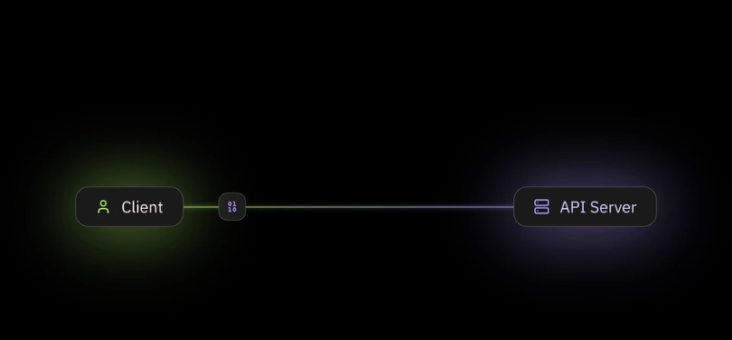
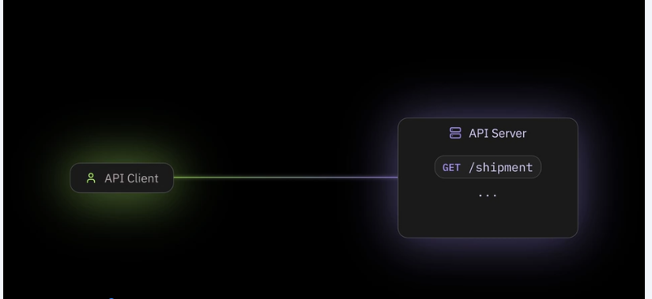
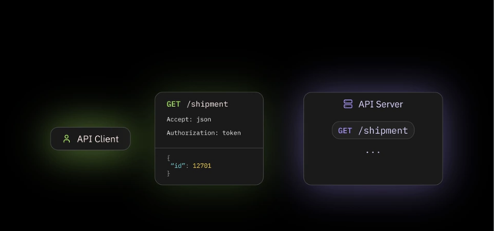
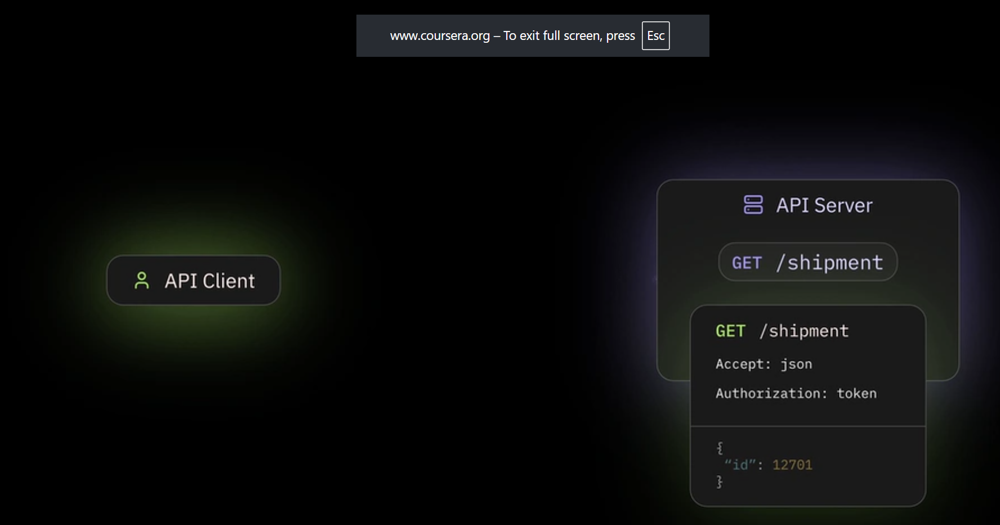
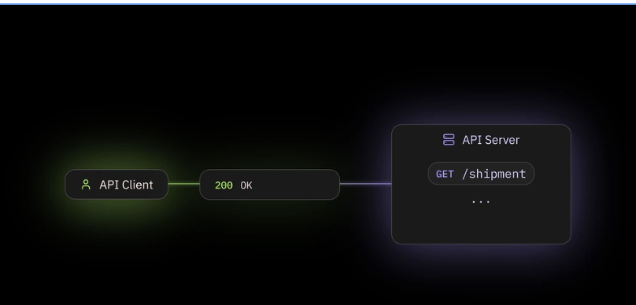
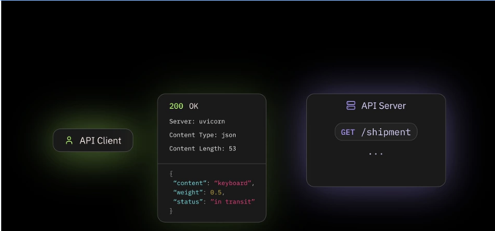

## What are REST APIs ?

API allows communication between a client and a server.

Think about when you check an order tracking status on a website, you visit the page, maybe enter tracking id and the website shows you the shipment status
Similarly, API allows a program to request data from another server directly using a code without needing a browser or user interface. This interaction is called an
API or Application Programming Interface

**REST** stands for representational state transfer is a popular approach for billing APIs. It provides a set of guidelines and rules of how these APIs should be designed
and function.

When a program needs to communicate with a REST API, it sends a request to a specific address on the server. This address is often called an endpoint, technically a uri or 
uniform resource identifer.

For the shipment status example, we might have an endpoint like /shipment

Here, a program sending an API request is called the client.

Now each request also uses a specific http method

### HTTP Methods

Common method include:

**GET**        : Read data               e.g., Get all users  

**POST**       : Create new data         e.g., Create a new user

**PUT**        : Replace existing data   

**DELETE**     : Remove data             e.g., Remove data

**PATCH**      : Partially update existing data   e.g., partially update existing data

**OPTIONS**    : Ask what methods or options are supported

Difference between **PUT** and **PATCH**: PUT means replace the entire information with this new version,  PATCH means  change only this particular part

Theses HTTP Methods tell the server what action the client want to perform on the resource at the endpoint.

In our example, if we only want reading the shipment data, we would send the request using the **GET** method

Besides , the methods and endpoints , a request often includes headers and often a body

**Headers** contain metadata about the request like the format of the data, or authentication details as plain key-value pairs, depending on the specific API endpoint,
you might need to include certain headers.

**Request body** is used to carry the data the server needs. In our example, to get details for a specific order, the body might contain the tracking id for the 
shipment. In REST APIs, the body data is usually sent in JSON format using key-value pairs   { "id" : 12701 }

JSON is easy for humans to read and write and it's also easy for machines to parse and generate

The client sends this request to the API server.

The Server is the machine that listens these requests. It receives the requests, processes it based on the endpoint method headers and body and then send back a response

Every API response include a status code which tells the client how the request went.

e.g., if you are getting status code **202** , it means ok, everything worked successfullly.

### Response Status Code

200    :   OK
400    :  Bad Request      , if a client sends something invalid
500    :  Server Error     , If server had a problem
418    :  I'm a teapot

- **2XX**        Success

- **3XX**       Redirection

- **4XX**       Client Side Error

- **5XX**       Server Side Error

for example, if we send a request to an endpoint that doesn't exist on the server, the server will send a response with a status code of 404 not found

In this way, the client can check the status code in the response to quickly determine if the request was successful

- Similar to request, a response also has headers and usually a body
- Response headers might contain information about the server, the format of the data in the response body or how large the data i

- there are possible headers and their meaning depend on the API
- the body of the response contain the actual data, the client asked for, this data is also in JSON format like the request body.

An API design following these rest principles is called RESTFUL APi

Simple, API allows program to talk with each other, REST offers a standard way to structure this communication.

A Client sends a request to the server, the server handles it and sends back a response, and that's the basic concept how REST API functions.

